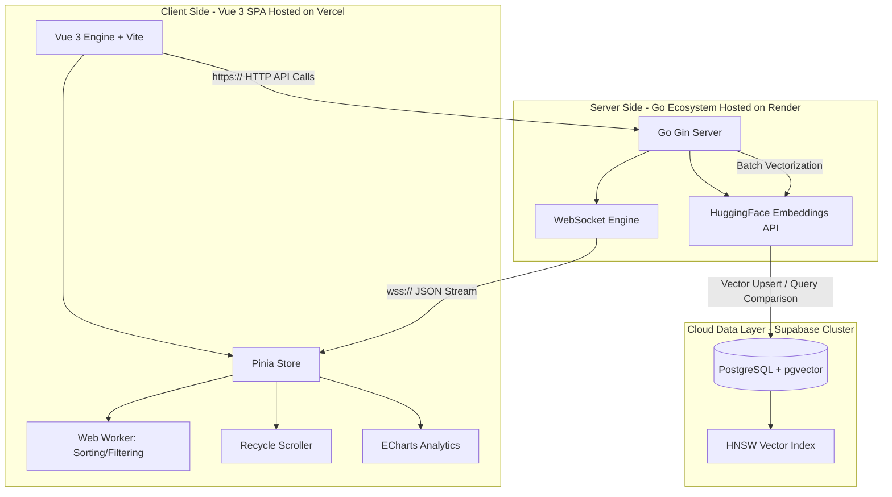

# PropTrack: AI-Powered Incident Intelligence

### **Project Status: Day 27/30 — Cloud Production & Pipeline Integration Finalized**

A high-performance observability platform built to transform raw log noise into searchable, semantic intelligence. ⚡

---

## ⚡ Performance Snapshot

| Metric                       | Specification                      | Environment      | Status                   |
| :--------------------------- | :--------------------------------- | :--------------- | :----------------------- |
| **Architectural Throughput** | 15k – 70k events/sec (Load Tested) | Go Concurrency   | 🚀 Validated             |
| **Local Ingestion Rate**     | ~375 events/sec (Optimized)        | Local Hardware   | 💻 Stable                |
| **Frontend UI Performance**  | 52 – 60 FPS (10k+ active rows)     | Vercel Live Edge | ✨ Stable via Web Worker |
| **Vector Database Latency**  | Sub-millisecond similarity lookup  | Supabase Cloud   | ⚡ Cloud DB + HNSW       |

---

## 🏗️ System Architecture

The architecture leverages a hybrid-cloud approach: local or containerized Go-concurrency for high-speed streaming, deep thread-isolation on the frontend, and a fully distributed cloud data layer for persistent semantic memory.



---

## ⚙️ Core Technical Specifications

- **🔄 Real-Time Streaming Engine:** High-concurrency Go server utilizing a single-handler WebSocket pattern for low-latency event distribution with built-in connection recovery and backpressure management.
- **🧠 AI & Semantic Memory:** Log messages are converted into vectorized payloads via the HuggingFace MiniLM inference models. A neural search overlay allows users to execute context-aware similarity lookups instantly.
- **🗄️ Production Vector Storage:** Distributed cloud PostgreSQL database (`pgvector`) powered by **Hierarchical Navigable Small World (HNSW)** indexing to guarantee $O(\log n)$ search complexity under scaling production data loads.
- **⚡ Thread-Isolated UI Pipeline:** Heavy data manipulations, array sorting, and pattern filtration are fully offloaded to background **Web Workers**. Rendering is constrained via a virtualized DOM to eliminate Main-Thread Long Tasks and lock down stable frame rates.

---

## 🛠️ Tech Stack

- **Frontend:** Vue 3 (Composition API), Pinia, Vite, TailwindCSS, Vue Virtual Scroller, ECharts.
- **Backend:** Go (Golang), Gin Gonic, Gorilla WebSocket, `pgx/v5` Connection Pool.
- **Cloud / Data Layer:** Supabase Cloud (Postgres), HuggingFace Serverless Inference API, Vercel (Edge UI Deployment), Render (Managed API Engine).

---

### 🚀 Getting Started

This platform can be reviewed through its live cloud production URLs, or spun up locally across native benchmark or container environments.

#### 🌍 Production Environment (Cloud Deployment)

The environment variables for the live application link the Vite client assets securely to your cloud cluster components:

- **API Gateway (HTTP):** `https://proptrack-backend.onrender.com`
- **Real-Time Gateway (WS):** `wss://proptrack-backend.onrender.com/ws`

---

#### 💻 Option A: Native Development Mode (Recommended for Local Benchmarking)

##### 1. Spin Up the Go Streaming Engine

```bash
cd backend
# Verify your local .env file contains your Supabase DATABASE_URL & HUGGINGFACE_TOKEN
go build -o main ./cmd/main.go
./main
```

##### 2. Launch the Thread-Isolated Frontend UI

```bash
cd frontend
npm install
npm run dev
```

_Your application will look for local variables using the Vite format (`VITE_API_URL=http://localhost:8080`)._

---

#### 🐋 Option B: Docker Containerized Mode (Production Simulation)

The project utilizes multi-stage Docker configurations to separate structural source compilations from the runtime environment, keeping container images extremely lightweight.

```bash
# Execute from the project root directory containing the docker-compose.yml file
docker-compose up --build
```

---

### 🔄 CI/CD Production Integration

The production pipeline utilizes an automated Git-Ops workflow:

1. **Frontend (`/frontend`) ➡️ Vercel:** Any code branch updates merged to production trigger a silent build hook on Vercel. Vue SFCs are minified, assets are chunked via Vite, and static targets are refreshed with zero site downtime.
2. **Backend (`/backend`) ➡️ Render:** Pushes to your tracked branch signal the Render engine. The environment steps directly into the root folder directory, builds the updated native binary (`go build -o main ./cmd/main.go`), and boots the application server running over port environment variables.
