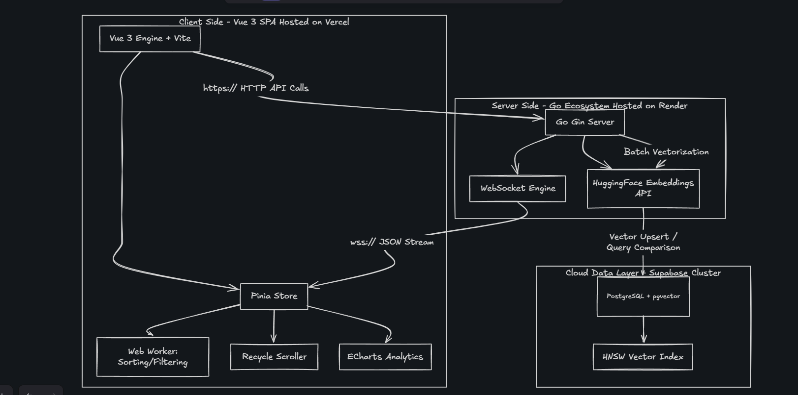

# PropTrack: AI-Powered Incident Intelligence

### Project Status

PropTrack is a high-performance observability platform engineered to transform raw log noise into searchable, semantic intelligence. The system balances high-throughput data ingestion with light, thread-isolated user interface rendering.

---

## Performance Benchmarks

| Metric                       | Specification                     | Evaluation Environment  | Verification Status     |
| :--------------------------- | :-------------------------------- | :---------------------- | :---------------------- |
| **Architectural Throughput** | 15k – 70k events/sec              | Go Concurrency Pipeline | Load Tested / Validated |
| **Local Ingestion Rate**     | ~375 events/sec                   | Standard Hardware       | Sustained / Stable      |
| **Frontend UI Performance**  | 52 – 60 FPS (10k+ active rows)    | Vercel Live Edge        | Stable via Web Worker   |
| **Vector Database Latency**  | Sub-millisecond similarity lookup | Supabase Cloud          | HNSW Index Optimized    |

---

## System Architecture

The architecture leverages a hybrid-cloud topology: local or containerized Go concurrency engines for high-speed streaming, deep thread-isolation on the client layer, and a fully distributed cloud data layer for persistent semantic memory.



---

## Core Technical Specifications

### Thread-Isolated UI Pipeline

Heavy data manipulations, array sorting, and complex pattern filtration are entirely offloaded to background **Web Workers**. Rendering is throttled via a virtualized DOM (`vue-virtual-scroller`) to eliminate Main-Thread Long Tasks and lock down stable frame rates.

### AI & Semantic Memory

Raw log messages are vectorized using HuggingFace MiniLM inference models. A neural search overlay allows users to execute context-aware similarity lookups instantly.

### Production Vector Storage

Distributed cloud PostgreSQL database (`pgvector`) optimized with **Hierarchical Navigable Small World (HNSW)** indexing to guarantee $O(\log n)$ search complexity under scaling data loads.

### Real-Time Streaming Engine

High-concurrency Go server utilizing a single-handler WebSocket pattern for low-latency event distribution, featuring automated connection recovery and backpressure management.

---

## Technology Stack

- **Frontend:** Vue 3 (Composition API) • Pinia • Vite • TailwindCSS • Vue Virtual Scroller • ECharts
- **Backend:** Go (Golang) • Gin Gonic • Gorilla WebSocket • `pgx/v5` Connection Pool
- **Cloud / Data Layer:** Supabase Cloud (Postgres) • HuggingFace Serverless Inference • Vercel • Render

---

## Deployment & Getting Started

### Production Cloud Environment

- **API Gateway (HTTP):** `https://proptrack-backend.onrender.com`
- **Real-Time Gateway (WS):** `wss://proptrack-backend.onrender.com/ws`

### Option A: Native Local Development

_Recommended for local benchmarking._

#### 1. Initialize the Go Streaming Engine

```bash
cd backend
# Ensure your local .env file contains valid DATABASE_URL and HUGGINGFACE_TOKEN values
go build -o main ./cmd/main.go
./main

2. Launch the Frontend UI
Bash

cd frontend
npm install
npm run dev

    Note: The local development application defaults to the Vite standard environment configuration (VITE_API_URL=http://localhost:8080).

Option B: Docker Containerized Mode

Recommended for production simulation.

The project utilizes multi-stage Docker configurations to decouple structural source compilation from the runtime environment, ensuring minimal container image footprints.
Bash

# Execute from the project root directory
docker-compose up --build

Continuous Integration & Deployment (CI/CD)
Frontend to Vercel

Merges to the tracking production branch trigger an automated build hook on Vercel. Vue Single File Components (SFCs) are minified, assets are chunked via Vite, and edge targets are updated with zero system downtime.
Backend to Render

Code pushes signal the Render deployment manager. The pipeline isolates the target folder directory, compiles the updated native binary (go build -o main ./cmd/main.go), and safely cycles the application server.
```
